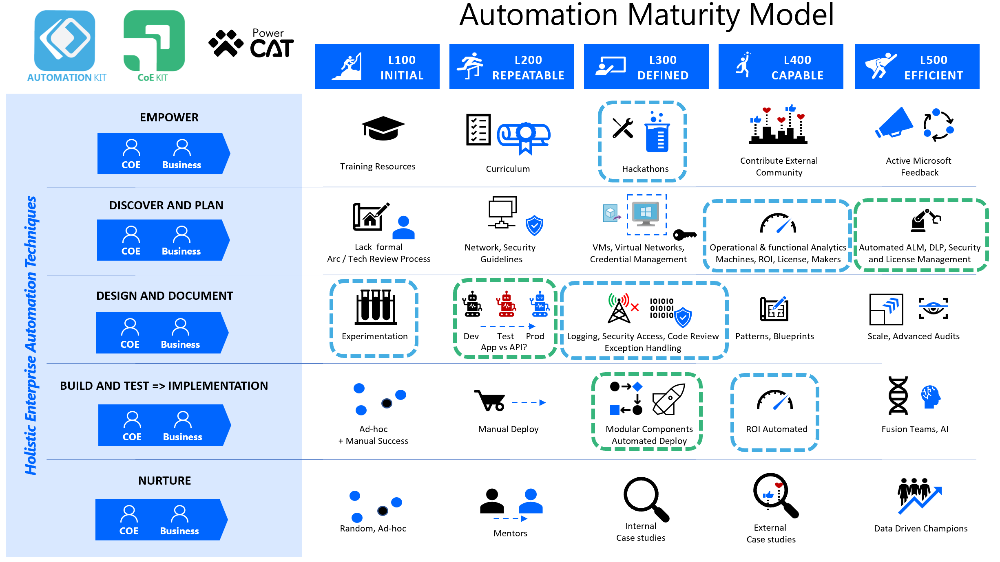

# Overview

When looking at key elements of creating a successful Automation Center of Excellence the following diagram provides an overview of how the Automation Kit and the [ALM Accelerator for Power Platform](https://aka.ms/aa4pp) combine together to cover different elements.

## Bot Development Lifecycle

- **Ideation** – The automation kit provides a process to create potential automation projects and approval process to determine which automation projects to invest time in

- **Build** – The ALM Accelerator provides the ability to build a managed deployment of a RPA solution with versioning applied from solutions stored in Source Control

- **Deploy** – The ALM Accelerator has the ability to configure and deploy solutions between development, test and production environments. The deployment process makes use of Azure DevOps and includes the ability to apply Branching and Merging to apply a source controlled governance and review process as a deployment progresses to production

## ALM Components

- **Code Review** – For solutions stored in Azure DevOps with the ALM Accelerator the ALM Accelerator YAML extension to unpack the robin script definition from the exported solution to an individual file for side

- **Monitoring** – The Automation kit has a near real time tracking process to use executions information to measure the impact of deployed solutions

- **Data Loss Prevention** – Determine the impact of DLP rules on deployed desktop flows

- **Dashboard and Data ETL** – Synchronize data from multiple environments to a centralized dashboard to monitor the impact of deployed solutions

## Automation Maturity Model

The [Automation Maturity Model](https://docs.microsoft.com/en-us/power-platform/guidance/automation-coe/automation-maturity-model-overview) provides a framework to look at how the Automation Kit and the ALM Accelerator can be combined to help customers grow their maturity in adopting Center of Excellence practices.

The Automation Kit can also be mapped against the Automation Maturity Model to assist customers to rapidly shift right to a more mature operational model (Level 300 - Level 500). Dotted blue boxes indicate areas that the existing Automation Kit addresses in the maturity model.

### Empower

Currently the Automation Kit can be used for Hackathons to help validate possible automation projects and monitor the impact of the Hackathon experiments.

### Discover and Plan

Use the Automation kit to plan for Automation projects and potential impact. Use the approval process to determine which projects to invest in and monitor the impact.

The ALM Accelerator enables profiles to be created that define environments that enables RPA solutions to be deployed between Validation, Test and Production environments.

### Design and Document

Enable makers to quickly experiment in development environments and then measure the impact of the experiments to see which viral automation projects are making large impact.

Use the ALM Accelerator to define deployment environments and deployment settings for Machines and Machine groups along with environment variables

### Build and Implement

Use the near real time ROI automation to monitor the impact of automation projects.

Use the ALM Accelerator to automate the deployment of RPA solutions so that the Automation Kit can monitor them.

## Related Projects

- ALM Accelerator for Power Platform - The ALM Accelerator is released as part of the [CoE Kit](http://www.github.com/microsoft/coe-starter-kit) and provides tools and templates to provide Enterprise scale end to end Application Lifecycle management.

- [RPA Enterprise Toolkit] - Michal Rok has published a separate open source [RPA Enterprise Toolkit](https://github.com/michalrok/Power-Automate-RPA-Enterprise-Toolkit) on GitHub that currently focuses on testing, queueing and modularity.